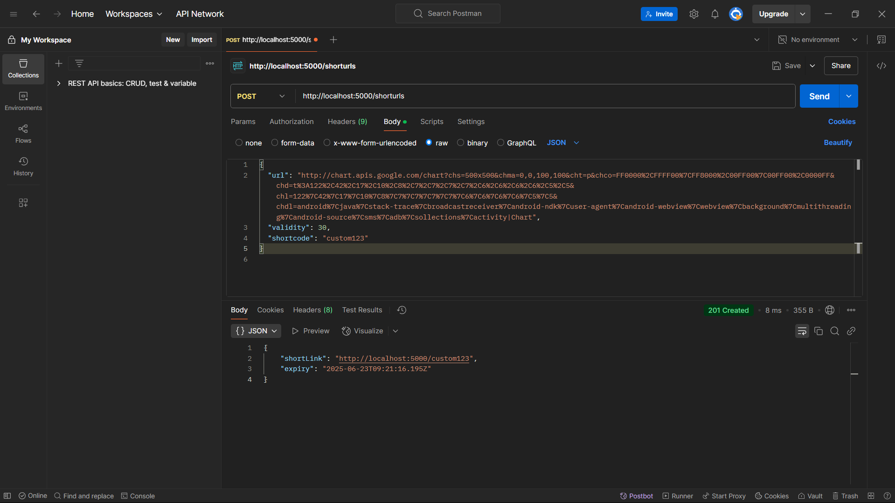
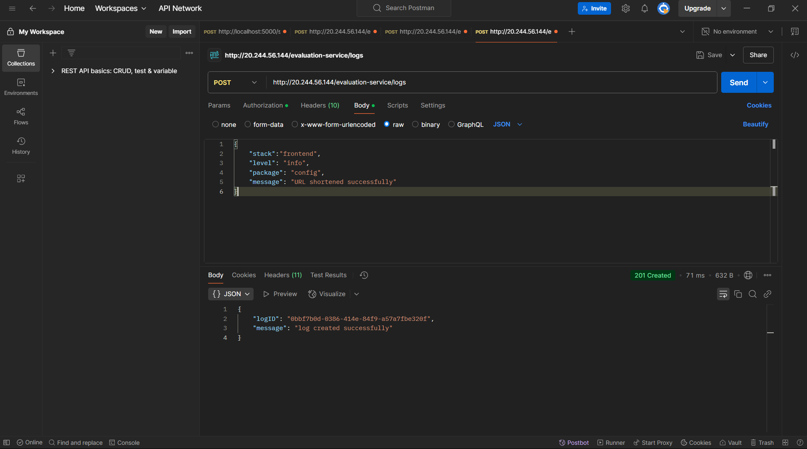
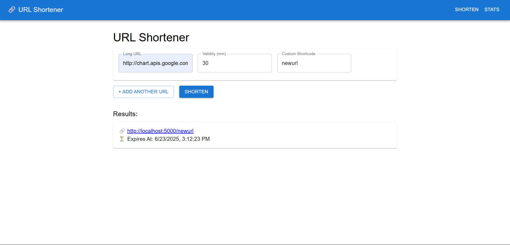
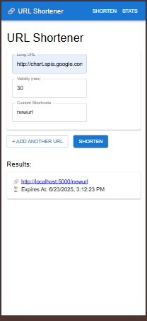
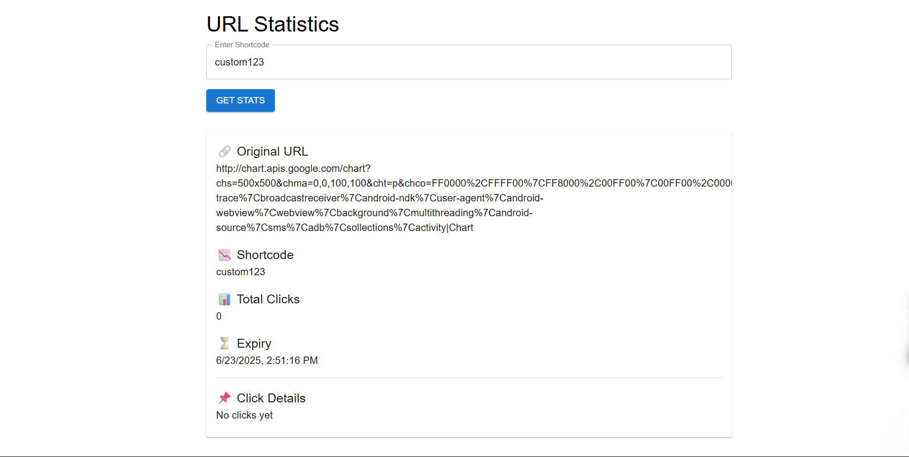
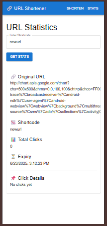

# Url Shortner

## Folder Strcture

<rollnumber>/
├── LoggingMiddleware/
│ └── logger.js
├── Backend Test Submission/
│ ├── server.js
│ ├── routes/
│ ├── middleware/
│ ├── utils/
│ └── ...
├── Frontend Test Submission/
│ ├── src/
│ ├── public/
│ ├── package.json
│ └── ...


---

## 🔗 Functionality Overview

This full-stack project includes:
- URL Shortening with optional expiry and custom shortcode
- Retrieval of usage statistics
- In-memory storage as per problem statement
- Frontend built using **React + Material UI**
- Backend built using **Node.js + Express**
- Logging Middleware integrated for both frontend and backend

---

## 🚀 Setup Instructions

### 🔧 Backend

```bash
cd Backend\ Test\ Submission
npm install
node server.js
```

Runs on http://localhost:5000

### 🖥 Frontend

```bash
cd Frontend\ Test\ Submission
npm install
npm run dev
```

Runs on: http://localhost:3000

```Ensure backend is running before using frontend.```

### 📘 API Endpoints (Backend)

1. Create Short Url
- **POST** /shorturl
```json
{
  "url": "https://example.com",
  "validity": 30,
  "shortcode": "custom123"
}
```

2. Retrieve Stats
- **GET** /shorturl/<shortcode>
Returns:
```json
{
  "originalUrl": "...",
  "expiry": "...",
  "clicks": 2,
  "clickData": [
    {
      "timestamp": "...",
      "referrer": "...",
      "ip": "..."
    }
  ]
}
```

### 🧠 Logging Middleware

 **Logging Format:**

 ```js
Log(stack, level, package, message)
```
- Logs are sent to: http://20.244.56.144/evaluation-service/logs

## Screenshots:

### API requests and response in Postman

**Postman response:**


**Postman logs:**


### Mobile and Desktop screenshot of UI

**Desktop Main Page:**


**Mobile Main Page:**


### Stats page showing clear history

**Desktop Stats Page:**


**Mobile Stats Page:**
